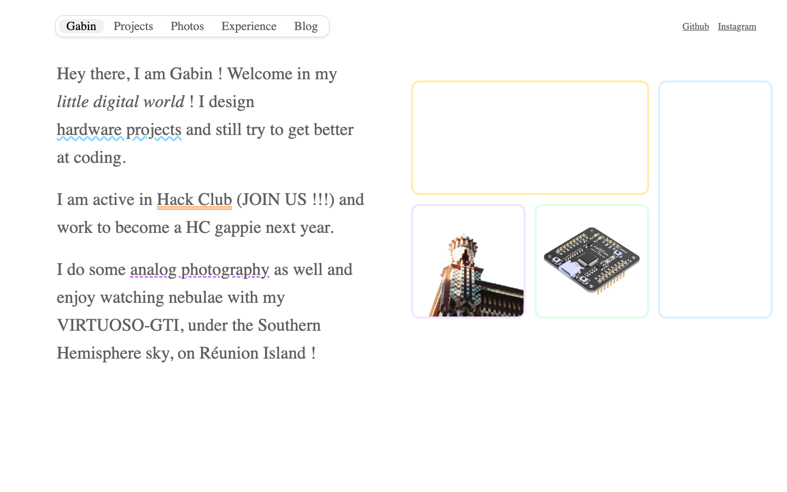
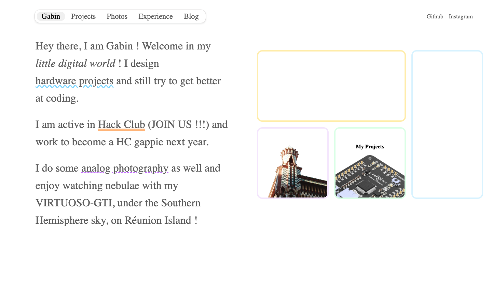
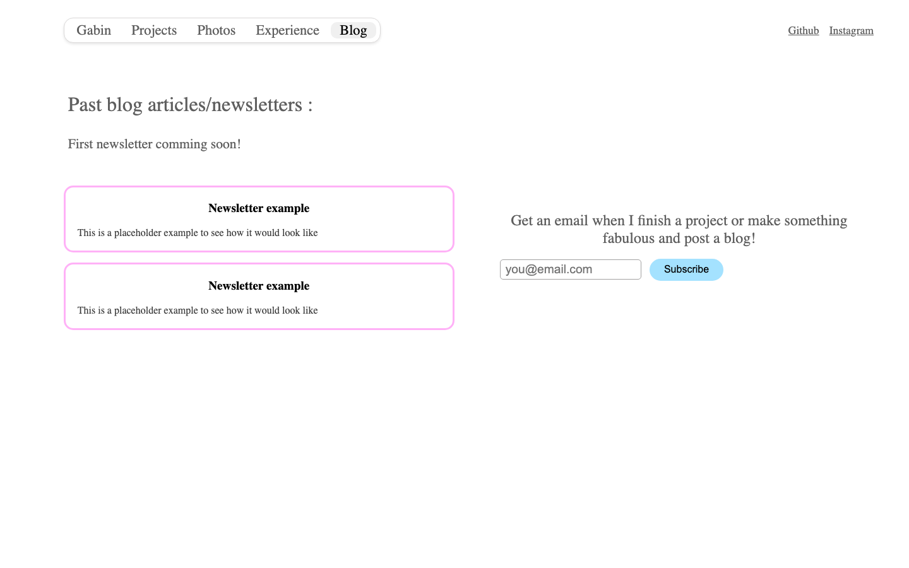
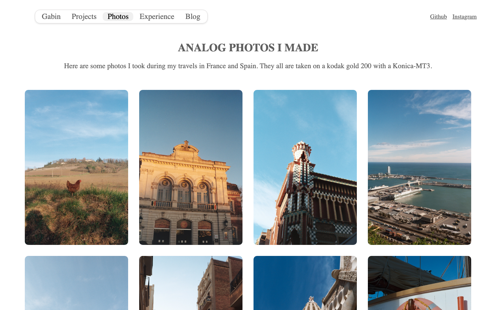
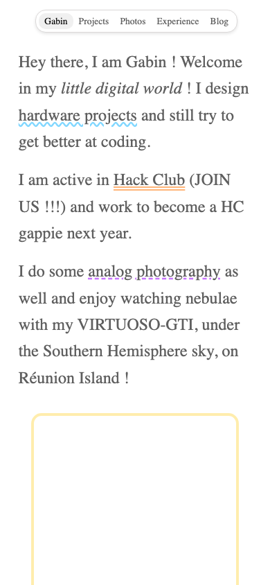

<h1 align="center">
   
  

   
  NEW.GABINTAVERNIER.COM
   
</h1>

<h4 align="center">
My "little digital world", a handmade personal website with HTML and CSS.
</h4>

  <a href="#about-the-project">About</a> •
  <a href="#pages">Pages</a> •
  <a href="#screenshots">Screenshots</a> •
  <a href="#repository-structure">Structure</a> •
  <a href="#contributing">Contributing</a> •
  <a href="#license">License</a> •
  <a href="#credits">Credits</a>

 

  

## About the Project

**new.gabintavernier.com** is my personal website, where I share my hardware projects, my analog photography and (soon) my blog/newsletter. Everything is written by hand: no framework, no build step, just HTML and CSS.

### Features

- **Animated boxes** on the home page that reveal my pictures and projects on hover
- **Analog photography gallery** shot on film, on Reunion Island and elsewhere
- **Newsletter subscription** powered by Buttondown (I lowk got my acc suspended but will be up soon)
- **Page ring webring** in the footer to discover other Hack Clubbers' websites
- **88x31 badge** because a personal website without one is not a real personal website
- **Fully responsive** layout, from desktop grids to stacked mobile views
- **Cutie pastel colors** and wavy underlines everywhere

## Pages

- `index.html` home page, with the animated boxes
- `projects.html` my hardware and software projects - will push it once finished
- `photos.html` my analog photography gallery
- `role.html` my experience at Hack Club and outside of it
- `blog.html` blog/newsletters archive + subscription form
- `contact.html` contact cards (hidden from the navbar, because it's useless for the moment, I have a github and instagram link on every page but it's still alive)

## Screenshots

  <table>
    <tr>
      <td valign="bottom"></td>
      <td valign="bottom"></td>
    </tr>
  </table>

  <table>
    <tr>
      <td valign="bottom"></td>
      <td valign="bottom"></td>
    </tr>
  </table>

## Repository Structure

- `*.html` one file per page
- `main.css` the single stylesheet for the whole site
- `images/` site assets (photos, badges, box illustrations)
- `images/readme/` screenshots used in this README

## Contributing

Suggestions, fixes and ideas are welcome! Please read the [CONTRIBUTING.md](CONTRIBUTING.md) guide to get started.

## License

This project is licensed under the **MIT License**, see the [LICENSE](LICENSE) file for details.

## Credits

This project uses:

- **GitHub Pages** for the hosting
- **[Buttondown](https://buttondown.com)** for the newsletter
- **[Pagering](https://pagering.gideon.sh)** for the webring in the footer
- **Hack Club** yay the community that made me want a website in the first place
- **[chester.how](https://chester.how)** the website I took inspiration from
